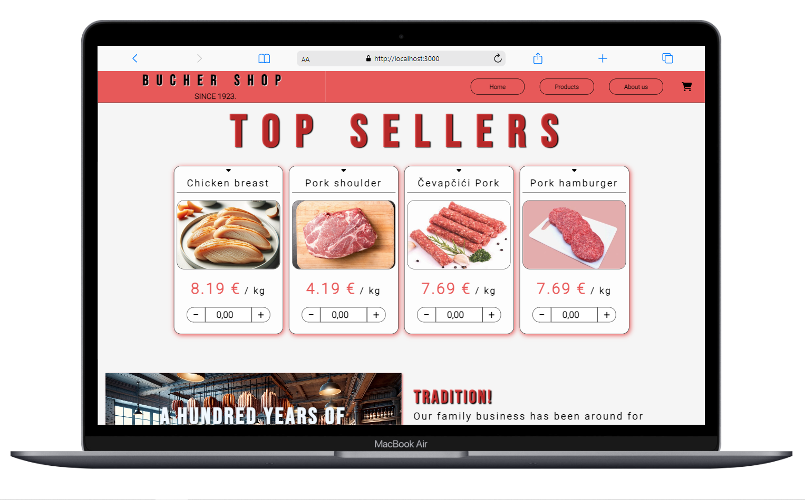
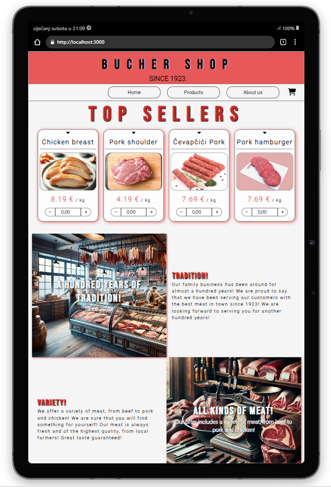
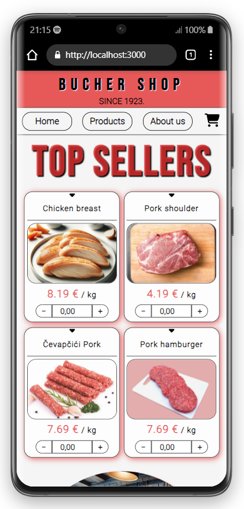

## My Projects

- ### [Bucher shop](https://github.com/andrija-zikovic/Mesnica)
    - [Web](https://mesnica02.oa.r.appspot.com/)
    - [GitHub Repo](https://github.com/andrija-zikovic/Mesnica)

## About Me

At the end of 2022, I experienced an injury at work that gave me the opportunity and time to start programming.

I started with **Python** and a few tutorials, but I didn't understand what I was doing and it bothered me. I didn't want to type blindly without understanding what was happening beneath those syntaxes I was writing.

I searched for the best content on the web to learn the depth of programming and discovered the well-known **[Harvard's CS50](https://cs50.harvard.edu/x/2023/)**, which was a big unknown for me at the time.

I immediately liked it because it was the closest thing to a college lecture out of all the tutorials I came across.

CS50 helped me understand the depth of programming. Now I understand the role of compilers, how machine language works, and how information is truly transmitted through ones and zeros. It introduced me to **SQL** databases and various data retrieval methods (Bubble sort, Merge sort, etc.).

After CS50, I started building my first websites with Python, Flask, and Jinja, which was when I first encountered JavaScript that I used in HTML scripts.

After completing everything I wanted to do with that first website, I felt somewhat limited in Flask.

I thought the problem was with the framework, so I decided to learn **React** because it is one of the more popular ones.

Through **[Dave Gray's React tutorial](https://www.youtube.com/watch?v=RVFAyFWO4go)** on YouTube, I began to understand the extent to which CSS and HTML were causing me problems and slowing down my progress.

I paused learning React and focused on:

- **[HTML tutorial](https://www.youtube.com/watch?v=mJgBOIoGihA)**
        - [HTML-tut Repo](https://github.com/andrija-zikovic/html-tut)
- **[CSS tutorial](https://www.youtube.com/watch?v=n4R2E7O-Ngo)**
        - [CSS-tut Repo](https://github.com/andrija-zikovic/css-tut)

In HTML, I had to familiarize myself better with the elements and attributes I wanted to use and needed. And in CSS, I needed to learn how to use flex, grid, and other styles to be able to position and style elements the way I wanted.

After that, I was ready to return to learning React.

Through the tutorial, I learned how to create components, how to use hooks like useState and useEffect, how to pass props through components, what prop drilling is and why it's not good, useContext, and useRef.

I really liked React, I felt like anything was possible. Everything was always possible, I just realized it then. It's fascinating how with that small device with a keyboard in your lap, you have unlimited possibilities. When you build a house, you have to go to hundreds of locations to solve problems related to that house. But in the digital world, you solve all problems from one place. Beautiful.

While working on this web store, I encountered a problem where I had to find a solution for manipulating products. How the store owner would create, modify, and edit products.

The logical solution was some kind of database, but I didn't want to manipulate the database from the frontend, so the only solution was to delve into some backend development. I searched for a good JavaScript backend framework that is used with React.

That's when I got to know **Node.js**. I decided to learn the basics of Node.js again through tutorials so that I could meet the needs of the web store.

- **[Node.js](https://www.youtube.com/watch?v=f2EqECiTBL8)**
    - [Node.js-tut Repo](https://github.com/andrija-zikovic/node.js--tut)

Through the tutorial and building my own server, I learned to use the following libraries:

- **[express.js](https://expressjs.com/)**
- **[cors](https://www.npmjs.com/package/cors)**
- **[cookie-parser](https://www.npmjs.com/package/cookie-parser)**
- **[mongoose](https://www.npmjs.com/package/mongoose)**
- **[nodemailer](https://www.npmjs.com/package/nodemailer)**
- **[bcrypt](https://www.npmjs.com/package/bcrypt)**
- **[jsonwebtoken](https://www.npmjs.com/package/jsonwebtoken)**
- **[qrcode](https://www.npmjs.com/package/qrcode)**
- **[date-fns](https://www.npmjs.com/package/date-fns)**
- **[@google-cloud/storage](https://www.npmjs.com/package/@google-cloud/storage)**
- **[multer](https://www.npmjs.com/package/multer)**
- **[sharp](https://www.npmjs.com/package/sharp)**
- **[uuid](https://www.npmjs.com/package/uuid)**
- **[nodemon](https://www.npmjs.com/package/nodemon)**
